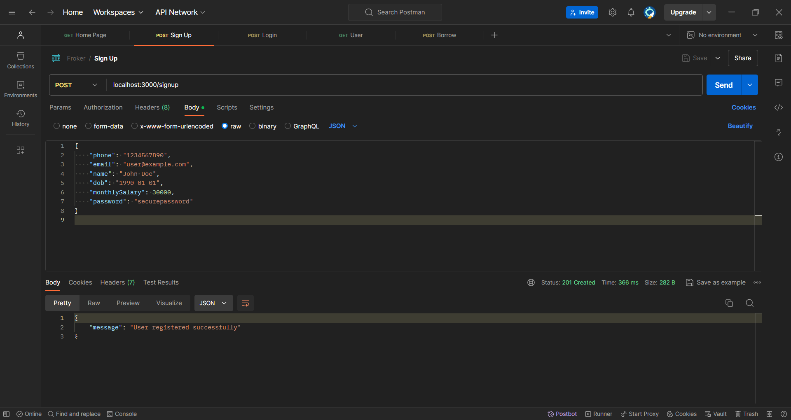
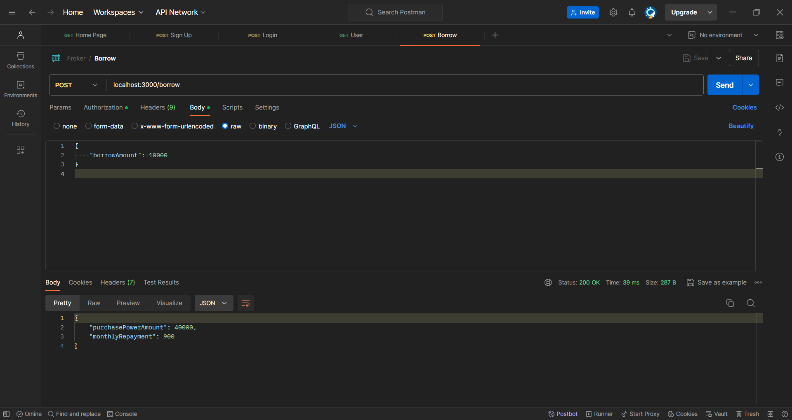

# Money Lending Application API

This backend service for a money lending application provides endpoints for user signup, login, viewing user data, and borrowing money. The application uses MongoDB for data storage and Node.js with Express for the server framework.

## Table of Contents

- [Overview](#overview)
- [API Endpoints](#api-endpoints)
  - [1. Approve Application During Signup](#1-approve-application-during-signup-post-signup)
  - [2. Login API](#2-login-api-post-login)
  - [3. Show User Data](#3-show-user-data-get-user)
  - [4. Borrow Money API](#4-borrow-money-api-post-borrow)
- [Installation](#installation)
- [Usage](#usage)
- [Screenshots](#screenshots)

## Overview

This project provides a backend for managing user applications, handling logins, retrieving user data, and processing loan borrow requests. The service is built using Node.js and Express and connects to a MongoDB database.

## API Endpoints

### 1. Approve Application During Signup (POST /signup)

**Description:**
Registers a new user after validating their age and monthly salary. Users must be at least 20 years old and have a monthly salary of 25,000 or more to be approved. Upon successful validation, the user’s account is created with an initial purchase power amount and a total borrow amount. The user’s application status is set to "approved".

**Request:**

- **Method:** POST
- **Endpoint:** `/signup`
- **Headers:** `Content-Type: application/json`
- **Payload:**
  ```json
  {
      "phone": "1234567890",
      "email": "user@example.com",
      "name": "John Doe",
      "dob": "1990-01-01",
      "monthlySalary": 30000,
      "password": "securepassword"
  }
  ```
- **Response:**
  - **Success (201):**

    ```json
    {
    "message": "User registered successfully"
    }

    ```
  - **Error(400):**

    - If age is less than 20:

    ```json
    {
    	"message": "User should be above 20 years of age"
    }
    ```

    - If monthly salary is less than 25,000:

    ```json
    {
    	"message": "Monthly salary should be 25k or more"
    }
    ```
  - **Error(500):**

  ```json
  {
      "message": "Internal server Error"
  }
  ```

### 2.Login API (POST /login)

**Description:**
Allows users to log in using their email and password. Returns a JWT token for authenticated access.

**Request:**

- **Method:** POST
- **Endpoint:** `/login`
- **Headers:** `Content-Type: application/json`
- **Payload:**
  ```json
  {
    "email": "user@example.com",
    "password": "securepassword"
  }
  ```
- **Response:**
  - **Success (200):**

    ```json
    {
    	"token": "<JWT token>"
    }
    ```
  - **Error(400):**

    - If user is not found:

    ```json
    {
    	"message": "User not found"
    }
    ```

    - If password is incorrect:

    ```json
    {
    	"message": "Invalid credentials"
    }
    ```
  - **Error(500):**

  ```json
  {
      "message": "Internal server Error"
  }
  ```

### 3.Show User Data (GET /user)

**Description:**
Retrieves the authenticated user's data including purchase power amount, phone number, email, date of registration, date of birth, and monthly salary. Requires a valid JWT token.
**Request:**

- **Method:** GET
- **Endpoint:** `/user`
- **Headers:** `Authorization: Bearer <token>`
- **Response:**
  - **Success (200):**

    ```json
    {
    	"purchasePowerAmount": 50000,
    	"phone": "1234567890",
    	"email": "user@example.com",
    	"dateOfRegistration": "2024-07-20T00:00:00.000Z",
    	"dob": "1990-01-01T00:00:00.000Z",
    	"monthlySalary": 30000
    }
    ```
  - **Error(401):**

    ```json
    {
      "message": "Authorization header missing"
    }
    ```
  - **Error(500):**

  ```json
  {
      "message": "Internal server Error"
  }
  ```

### 4.Borrow Money API (POST /borrow)

**Description:**
Allows authenticated users to borrow money. Updates the purchase power amount and calculates the monthly repayment amount with an 8% interest rate over 12 months. Requires a valid JWT token.

**Request:**

- **Method:** POST
- **Endpoint:** `/borrow`
- **Headers:** `Authorization: Bearer <token> Content-Type: application/json`
- **Payload:**
  ```json
  {
    "borrowAmount": 10000
  }
  ```
- **Response:**
  - **Success (200):**

    ```json
    {
    	"purchasePowerAmount": 40000,
    	"monthlyRepayment": 900
    }

    ```
  - **Error(404):**

    ```json
    {
    	"message": "User not found"
    }
    ```
  - **Error(500):**

  ```json
  {
      "message": "Internal server Error"
  }
  ```

## Installation

1. **Clone the Repository:**

```sh
  	git clone https://github.com/yourusername/your-repository-name.git
```

2. **Navigate to Project Directory:**

```sh
  	cd repository-name
```

3. **Install Dependencies: **

```sh
  	npm Install
```

4. **Set Up Environment Variables:**
   Create a .env file in the root directory of your project and add the following variables. Update the values as needed:

```env
  	MONGO_URI=mongodb://localhost:27017/your-database-name
  	JWT_SECRET=your_jwt_secret_key
```

5. **Start the Server:**

```npm
  	npm start
```

  The server will start on http://localhost:3000 by default.

## Usage

Ensure MongoDB is running on your local machine or configure the connection string in the .env file to connect to a remote MongoDB instance.

## Screenshots

**Home Route**

**Sign Up**

**Login**

**User**

**Borrow**

